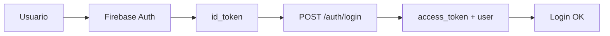

# 🚀 Guía Rápida - Login con API Railway

## ✅ Configuración Completada

La aplicación está configurada para usar la API de Railway:

- **URL API:** `https://web-production-2d737.up.railway.app`
- **Documentación:** https://web-production-2d737.up.railway.app/docs
- **Estado:** ✅ API funcionando correctamente

## 🏃‍♂️ Inicio Rápido

### 1. Verificar Variables de Entorno

El archivo `frontend/.env.local` ya está configurado con:

```bash
VITE_API_URL=https://web-production-2d737.up.railway.app
VITE_USE_FIREBASE=false
```

### 2. Iniciar la Aplicación

```bash
cd frontend
npm run dev
```

### 3. Probar el Login

1. Abre http://localhost:5173
2. Ingresa tus credenciales de Firebase
3. El sistema:
   - Autentica con Firebase
   - Obtiene un `id_token`
   - Lo envía a `/auth/login` de Railway
   - Recibe `access_token` y datos del usuario

## 🔍 Verificar Funcionamiento

### Logs en Consola del Navegador

Deberías ver algo como:

```
🔐 Attempting direct API login: { email: "usuario@example.com" }
📡 Authenticating with Firebase to get id_token...
✅ Firebase id_token obtained
🌐 Logging in to API: https://web-production-2d737.up.railway.app/auth/login
📥 API response: { status: 200, statusText: "OK", ok: true }
✅ API login successful
```

### Red (Network Tab)

Deberías ver estas peticiones:

1. Firebase Authentication
2. `POST https://web-production-2d737.up.railway.app/auth/login`
3. Status: `200 OK`

## 🧪 Probar la API Manualmente

```bash
# Ejecutar script de prueba
.\test-api-connection.ps1
```

Este script verifica:

- ✅ Health check
- ✅ Ping
- ✅ Endpoint de login
- ✅ CORS
- ✅ Firebase connection
- ✅ Endpoint de parques

## 📚 Documentación Detallada

- **[AUTENTICACION_API.md](AUTENTICACION_API.md)** - Documentación completa del flujo
- **[CHANGELOG_AUTENTICACION.md](CHANGELOG_AUTENTICACION.md)** - Resumen de cambios

## 🔧 Cambios Principales

### Archivo: `frontend/src/api/auth.ts`

- ✨ **Nueva función:** `loginWithAPI()` - Login directo con Railway
- ✨ **Función alternativa:** `loginWithFirebase()` - Con validación de sesión
- ✅ Variable `VITE_USE_FIREBASE` para cambiar entre flujos

### Flujo de Autenticación



## 🐛 Solución de Problemas

### Error: "Token inválido"

**Causa:** El id_token de Firebase expiró  
**Solución:** Vuelve a iniciar sesión

### Error: "Usuario no encontrado"

**Causa:** El usuario no existe en Firebase  
**Solución:** Verifica las credenciales o registra el usuario

### Error: CORS

**Causa:** La API no permite tu dominio  
**Solución:** Ya está configurado en Railway, verifica con `.\test-api-connection.ps1`

### No se conecta a la API

**Causa:** URL incorrecta o API caída  
**Solución:** Verifica que `VITE_API_URL` en `.env.local` sea correcta

## 📊 Estados de la Aplicación

### ✅ Funcionando

- Conectividad con Railway API
- Firebase Authentication
- Endpoint `/auth/login`
- CORS configurado
- Endpoints de parques

### 🚧 Por Probar

- Login completo con usuario real
- Navegación post-login
- Persistencia de sesión
- Refresh de token

## 🚀 Desplegar a Producción

### Variables de Entorno en Vercel

```bash
VITE_API_URL=https://web-production-2d737.up.railway.app
VITE_USE_FIREBASE=false
VITE_FIREBASE_API_KEY=...
VITE_FIREBASE_AUTH_DOMAIN=...
VITE_FIREBASE_PROJECT_ID=...
VITE_FIREBASE_STORAGE_BUCKET=...
VITE_FIREBASE_MESSAGING_SENDER_ID=...
VITE_FIREBASE_APP_ID=...
```

### Comandos

```bash
# Build
npm run build

# Deploy a Vercel
vercel --prod
```

## 📞 Soporte

- **Documentación API:** https://web-production-2d737.up.railway.app/docs
- **Logs detallados:** Consola del navegador (F12)
- **Test de conectividad:** `.\test-api-connection.ps1`

---

**Última actualización:** Febrero 4, 2026  
**Estado:** ✅ API configurada y funcionando
